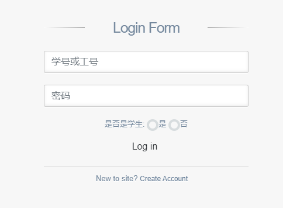
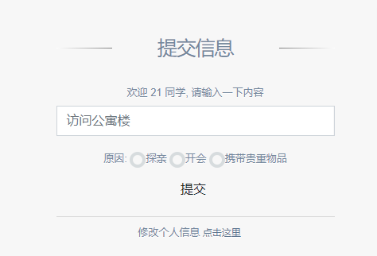

# Student-Dormitory-System
## 学生宿舍管理系统 (javaweb课设)

### 配置环境
* 数据库: mysql
    * 地址: localhost
    * 用户名: root
    * 密码: 123456
* Java Web
    * Maven
    * Tomcat
    * Bootstrap
    
### Usage
1. 建立数据库student_system表, 导入[student_system.sql](student_system.sql)并运行
2. 需要把[mysql-connector-java-8.0.16.jar](/lib/mysql-connector-java-8.0.16.jar)拷贝到tomcat下lib目录下，然后，右键【工程】，点击【properties】，然后点击【Java Build Path】,点击【Add External Jars...】，从tomcat下lib目录中选择对应的mysql-connector-java-8.0.16.jar，然后点击【OK】即可。
3. 导入IDEA, 配置好环境即可运行

### 介绍
#### 登录界面(学生和宿舍管理员登录)

#### 提交信息界面(来访人员访问宿舍提交信息)

#### 查看信息界面(宿舍管理员查看访问记录)
